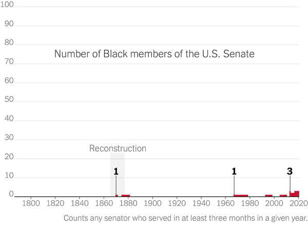
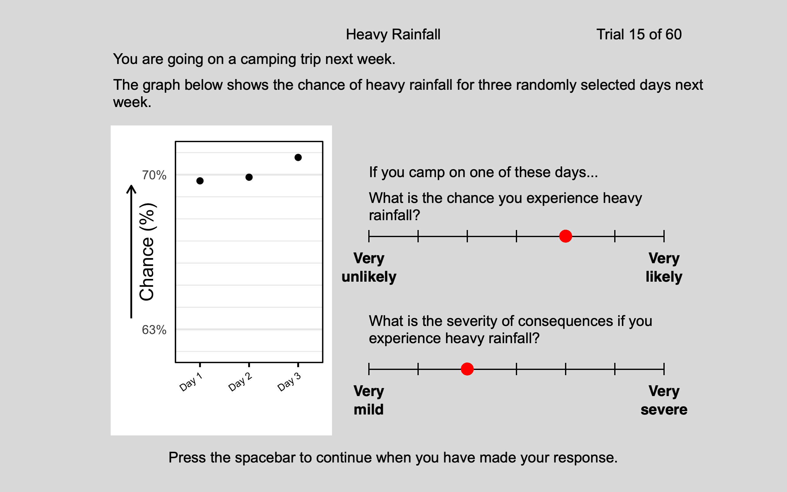

```{r setup, include=FALSE}
set.seed(45789) # seed for random number generation
knitr::opts_chunk$set(cache.extra = knitr::rand_seed) # Discard cache when random seed changes
knitr::opts_chunk$set(cache.comments = FALSE) # ignore changes to comments

# Loading packages
library(papaja) 
library(tidyverse) 
library(ordinal) 
library(patchwork)
library(magick) 
library(emmeans) 
library(egg) 
library(scales) 
library(buildmer) 
library(lme4)
library(broom)
library(insight)
library(qwraps2)
```

```{r lazy-load-models, include=FALSE}
lazyload_cache_dir('position_magnitude_cache/latex')
```

```{r load-data, include=FALSE}
risk1_anon <- read_csv("data/risk1_anon.csv")
risk2_anon <- read_csv("data/risk2_anon.csv")
risk3_anon <- read_csv("data/risk3_anon.csv")
```

```{r wrangle, include=FALSE}
wrangle <- function(anon_file) {

# extract literacy data
  literacy <- anon_file %>%
    filter(!is.na(q1_slider.response)) %>%
    rowwise() %>%
    mutate(literacy = mean(c(q1_slider.response, 
                           q2_slider.response, 
                           q3_slider.response, 
                           q4_slider.response, 
                           q5_slider.response))) %>%
    select(participant,
         literacy)

edu_labels <- set_names(c('No formal qualications',
                'Secondary education (e.g. GED/GCSE)',
                'High school diploma/A-levels',
                'Technical/community college',
                'Undergraduate degree (BA/BSc/other)',
                'Graduate degree (MA/MSc/MPhil/other)',
                'Doctorate degree (PhD/other)',
                'Don\'t know / not applicable'),
          seq(8,1,-1))

# extract demographics

  demographics <- anon_file %>%
  filter(!is.na(gender_slider.response)) %>%
  mutate(gender_slider.response = recode(gender_slider.response, 
                                         `1` = "F", 
                                         `2` = "M", 
                                         `3` = "NB")) %>%
  mutate(across(matches("edu_slider.response"),
                ~recode(edu_slider.response, !!!edu_labels))) %>%
      select(matches(c("participant",
                   "age_textbox.text",
                   "gender_slider.response",
                   "edu_slider.response")))
  
  anon_file %>% 
  select(matches(c("participant", 
                   "item_no",
                   "condition",
                   "pos",
                   "orientation",
                   "chance_slider.response",
                   "severity_slider.response",
                   "chance_slider.rt",
                   "severity_slider.rt",
                   "data_mean",
                   "key_resp.rt",
                   "type"))) %>% 
      filter(type == "E") %>%
        inner_join(literacy, by = "participant") %>%
    inner_join(demographics, by = "participant") %>%
      mutate(across(matches(c("pos", "orientation", "condition")), as_factor)) %>%
  mutate(across(c("chance_slider.response",
                  "severity_slider.response"), as.ordered)) %>%
  mutate(across(c("participant",
                  "item_no"), as.character)) %>%
  rename("ori"= matches("orientation")) %>%
  assign(paste0(unique(anon_file$expName), "_tidy"),
         value = ., envir = .GlobalEnv)
}

walk(list(risk1_anon,
         risk2_anon,
         risk3_anon),
    wrangle)

contrasts(risk1_tidy$condition) <- matrix(c(.5, -.5))
contrasts(risk2_tidy$ori) <- matrix(c(.5, -.5))
contrasts(risk2_tidy$pos) <- matrix(c(.5, -.5))
contrasts(risk3_tidy$condition) <- matrix(c(.5, -.5))
```

```{r fix-age-typo, include=FALSE}
# age typo
max(risk2_tidy$age_textbox.text)

# finding session number for this participant
age188session <- risk2_anon %>% filter(age_textbox.text == 188) %>% pull(session)

# using session code to find true age in csv of demographic data from prolific (prolific_export.csv)
# we are unable to include this csv as it contains Prolific participant IDs
# prolific_export %>%
#   filter(session_id == age188session) %>% pull(age)
# [1] 18
risk2_tidy <- risk2_tidy %>% 
  mutate(age_textbox.text = recode(age_textbox.text, `188` = 18))

max(risk2_tidy$age_textbox.text)
```

```{r comparison-function, include=FALSE}
comparison <- function(model, remove = NULL) {
  
  form <- formula(model)
  
  reducefixed <- function(form) {
    
    fixedfx <- 
      remove.terms(form,"placeholder") %>% # generate full formula (expand '*')
      nobars() # get formula for fixed effects only
    
    fixedterms <-  
      terms.formula(fixedfx) %>% # get terms for fixed effects
      attr("term.labels") # get character vector of fixed effects terms
    
    out <- remove.terms(fixedfx, tail(fixedterms, n=1))
    
    # remove will only take a single character string, not a character vector
    if(!is.null(remove))
      out <- remove.terms(fixedfx, remove)
    
    return(out)
  }
  
  getrandom <- function(form) {
    
    parens <- function(x) {paste0("(",x,")")}
    onlyBars <- function(form) {
      reformulate(
        sapply(
          findbars(form), # list of character vector for each random effect
          function(x)  parens(deparse(x))), # put each character vector in brackets
        response = form[[2]]) 
    }
    
    out <- onlyBars(form)
    return(out)
  }
  
  merge.formula <- function(form1, form2, ...){
    # adapted from https://stevencarlislewalker.wordpress.com/2012/08/06/merging-combining-adding-together-two-formula-objects-in-r/
    
    # get character strings of the names for the responses 
    # (i.e. left hand sides, lhs)
    lhs1 <- deparse(form1[[2]])
    #print(lhs1)
    lhs2 <- deparse(form2[[2]])
    #print(lhs2)
    if(lhs1 != lhs2) stop('both formulas must have the same response')
    
    # get character strings of the right hand sides
    rhs1 <- strsplit(paste(form1[3]), " \\+ ")[[1]] 
    rhs2 <- strsplit(paste(form2[3]), " \\+ ")[[1]] 
    
    # put the two sides together with the amazing 
    # reformulate function
    out <- reformulate(termlabels = c(rhs1, rhs2), 
                       response = lhs1)
    
    # set the environment of the formula (i.e. where should
    # R look for variables when data aren't specified?)
    #environment(out) <- parent.frame()
    return(out)
  }
  
  newfixedfx <- reducefixed(form)
  fullranfx <- getrandom(form)
  merge.formula(newfixedfx, fullranfx)
  
}
```

```{r anova-results-function, include=FALSE}
anova_results <- function(model, cmpr_model) {
  
  # first argument 
  model_name <- deparse(substitute(model))
  
  if (class(model) == "buildmer")  model <- model@model
  if (class(cmpr_model) == "buildmer") cmpr_model <- cmpr_model@model
      
  anova_output <- ordinal:::anova.clm(model, cmpr_model)
  # use of ordinal:::anova.clm based on https://github.com/runehaubo/ordinal/issues/38  
  
  assign(paste0(model_name, ".LR"),
         anova_output$LR.stat[2],
         envir = .GlobalEnv)
  assign(paste0(model_name, ".df"),
         anova_output$df[2],
         envir = .GlobalEnv)
  assign(paste0(model_name, ".p"),
         anova_output$`Pr(>Chisq)`[2],
         envir = .GlobalEnv)
}
```

```{r random-str-function, include=FALSE}
random_str <- function(model) {
  model <- model@model
  terms <- model %>% find_random %>% unlist() %>% unname()
  mylist <- model %>% formula %>% findbars() %>% as.character()
  slopes <- lapply(mylist, str_extract, "(?<=\\+ )(.*)(?=\\| )") %>% 
    unlist()
  tibble(terms, slopes)
}
```

# Introduction {-}

Context is crucial for effectively judging the magnitude of numbers. A 40% probability is twice as great as a 20% probability, but in the absence of context, it is unclear whether this value should be considered large or small. For the chance of experiencing post-surgery complications, 40%, but may be considered small for the chance that a laboratory test can successfully detect a disease.

In charts, numerical axes often provide some contextual cues for judging the magnitude of plotted values (how large or small they are). The range of values on an axis provides a frame of reference for assessing whether a data point is large or small. A bar chart produced by the New York Times, which plots over time the number of black members of the U.S. senate, provides a striking illustration (Figure \@ref(fig:nyt-chart)). Unusually, the continuous y-axis does not terminate just above the highest value. Instead, it extends all the way to the maximum possible number of senators: 100. As a result, bars representing black senators are confined to the very bottom, visible just above the x-axis, and a significant expanse of blank space looms above them. This highlights the absent data points: the vast majority of senators who are not black. The visual arrangement communicates the magnitude of the plotted values in context. 

```{r nyt-chart, fig.cap= "In this chart, the y-axis limit is the largest possible value, rather than the largest observed value, so plotted values appear to have particularly small magnitudes.", echo=FALSE, out.width="250px"}

```

It is unclear exactly how an axis range influences a user's inferences about magnitude. One possible explanation is that the unfilled area indicates the range of plausible values. That is, plotted values may be judged as small in magnitude because the potential for substantially larger values is clearly displayed. Alternatively, assessments of magnitude may be influenced by the appearance of plotted values only, and not through contrast with blank space. Users may simply judge data points at higher positions as 'high' and those lower down as 'low', regardless of any other cues which might communicate magnitude. The present set of experiments explores which of these two accounts explains how axis ranges contribute to the communication of magnitude.

## Effects of Context on Magnitude Judgements

Empirical evidence demonstrates that judgement of a value's magnitude depends on its relationship to a grand total or to surrounding values. This affects interpretation of verbal approximations, and also absolute values. For example, participants instructed to take 'a few' marbles picked up more when the total number available was larger (Borges & Sawyers, 1974) and rated satisfaction with the same salary as higher when it appeared in the upper end of a range, compared to the lower end (Brown, Gardner, Oswald, & Qian, 2008). 

## Effects of Axis Limits on Comparison of Values

Several studies have explored how axis limits can alter impressions of the *relationships between* presented values, rather than the magnitude of the values themselves. When axis ranges are expanded to create blank space around a cluster of data points, correlation between those points is judged as stronger (Cleveland, Diaconis, & McGill, 1982). In bar charts, participants rate the differences between values as greater when the vertical gap between bars is larger, due to a truncated y-axis (Pandey, Rall, Satterthwaite, Nov, & Bertini, 2015). Correll et al.'s (2020) experiments found that greater truncation resulted in higher effect-size judgements in both line charts and bar charts. Truncation effects persisted even when participants estimated the values of specific data points, suggesting this bias is driven by initial impressions, rather than a misinterpretation of the values portrayed by graphical markings. Correll et al. (2020) found no reduction in effect size judgements when truncation was communicated using graphical techniques (e.g., axis breaks and gradients). The unavoidable consequence, they suggest, is that designers' choices will influence users' interpretations whether axes are truncated or not.

Choosing an appropriate axis range involves a trade-off between bias (over-reliance on visual appearence of differences) and sensitivity (capacity to visually recognise differences that exist). Just as a highly truncated y-axis can exaggerate trivial differences between values, an axis spanning the entire range of possible values can conceal important differences (Witt, 2019). Based on participants' judgements of effect size, Witt (2019) found that bias was reduced and sensitivity increased when using an axis range of approximately 1.5 standard deviations of the plotted data, compared to axes which spanned only the range of the data, or the full range of possible values (0-100). This provides further evidence of a powerful association between the appearance of data, when plotted, and subjective interpretations of these data.

Further evidence of truncation effects, provided by Yang et al. (2021), improves on the design of previous studies which employed only a few observations per condition (Pandey et al., 2015) or very small sample sizes (Witt, 2019), thus resulting in a lack of experimental power. Low powered studies tend to the overestimate magnitude of true effect sizes. Participants' ratings of the difference between two bars consistently provided evidence of the exaggerating effects of y-axis truncation. Yang et al. (2021) discussed various potential mechanisms behind truncation effects and noted that the effect appears to be largely automatic, so may function like an anchoring effect, where a numerical judgement is influence by a reference point (Tversky & Kahneman, 1981). Another explanation draws upon Grice's cooperative principle (Grice, 1975). According to this account of effective communication, speakers are assumed to be in cooperation, and so will communicate in a manner that is informative, truthful, relevant, and straightforward. Therefore, a user will assume that a difference must be genuinely large if it appears large, else it would not be presented that way. Effective visualisations should be designed so a user's instinctive characterisation of the data corresponds closely to their interpretation following a more detailed inspection (Yang et al., 2021).

## Effects of Axis Limits on Extraction of Values

The above research consistently demonstrates that relationships between data points are interpreted differently depending on the appearance of the data points when plotted. The present investigation is concerned with how interpretations of the magnitude of *the values themselves* are affected by their visual properties. From a cognitive processing perspective, vertical position is a strong index of magnitude. For example, children appear to intuitively understand the relationship between height and value (Gattis, 2002). Both the physical world, and language (e.g., spatial metaphors), provide countless examples where 'higher' is associated with 'more', and 'lower' with 'less', and this principle has been adopted as a convention in data visualisation (Tversky, 1997).

Research on data visualisations demonstrates the strength of the association between magnitude and vertical position: inversions of this mapping in charts can lead to misinterpretations (Okan, Garcia-Retamero, Galesic, & Cokely, 2012; Pandey et al., 2015, Woodin et al., 2021). Furthermore, other research has found that when a company's financial performance was displayed entirely in the bottom fifth of a line chart, the company was perceived as less successful than when no blank space appeared above the maximum value (Taylor & Anderson, 1986). Sandman et al., (1994) investigated assessments of magnitude in risk ladders, where greater risks are presented at physically higher positions on a vertical scale. To assist evaluation of risk magnitudes for asbestos exposure (a relatively unfamiliar hazard), a scale for smoking frequency (a more familiar hazard) was presented alongside for reference. Participants rated the threat of asbestos higher when it was plotted at a higher position. 

The above findings can be regarded as preliminary evidence that changing axis limits may affect appraisals of data points' magnitudes. However, the evidence for this is far from strong. Taylor and Anderson (1986) did not disclose how judgements were elicited, or provide details of their sample size. Sandman et al. (1994) only explored responses towards one specific risk (asbestos), and each participant only took part in a single trial. In addition, the 'threat' measure they used was a composite of several separate ratings, which prevents diagnosis of whether manipulations affected interpretations of the plotted information in particular, or just related concepts. Further, both studies introduced a confounding variable by adjusting the difference between the minimum and maximum y-axis values across conditions. To understand how different displays of the same data elicit different inferences about magnitude, and to provide recommendations for best practice, stronger evidence is required, as is an investigation into the possible cognitive mechanisms involved in the generation of these inferences. 

## The Present Study

In a set of three experiments we investigate how employing different axis limits affects interpretations of the magnitude of plotted values. This manipulation changes both the context surrounding data points, and their physical positions, but crucially the numerical values themselves remain the same.

All data visualisations used in the present set of experiments displayed the probability of the occurrence of negative events. This provides participants with a purpose; evaluating information in such risk scenarios is a more meaningful task than assessing, in an abstract manner, how 'large' a value is. Furthermore, charts are frequently used for risk communication, and manipulating aspects of a chart can change interpretations of the risks displayed (Elting, Martin, Cantor, & Rubenstein, 1999; Feldman-Stewart, Kocovski, McConnell, Brundage, & Mackillop, 2000; Keller, Siegrist, & Visschers, 2009; Okan, Stone, Parillo, Bruine de Bruin, & Parker, 2020; Zikmund-Fisher, Fagerlin, & Ubel, 2005).

Risk events are composed of two core components: 1) probability of occurrence and 2) severity of harm. Individuals' assessments of probability and severity are not necessarily independent. A particular event is perceived as more likely when it is described as having more severe outcomes (Harris & Corner, 2011, Harris et al., 2009). In a similar manner, a particular event is associated with more substantial consequences when it is described as more probable (Kupor & Laurin, 2020). One account suggests that perceptions of probability and outcome magnitude are related because they are both assumed to reflect the potency of the event's cause (probability-outcome correspondence principle; Keren & Teigen, 2001). According to this account, probabilities can occasionally provide meaningful indications of magnitude (e.g., rainfall), but it is inappropriate to apply this perspective to all situations (e.g., volcanic eruptions). Therefore, even though charts in the present set of experiments only display outcome probability, assessments of outcome severity may also differ between conditions. Collecting separate judgements of outcome probability and outcome severity for each scenario provides a clearer picture how the manipulation affects each aspect of participants' representations of risk. Use of Likert scales (with discrete options) rather than visual analogue scales (with continuous options; Sung & Wu, 2018) prevents participants from simply mapping probability percentages directly onto a linear scale. We also administered a data visualisation literacy measure, to determine the degree to which our manipulation affects interpretations after we have accounted for differences in graph literacy. Responses to visualisations which violate graphical conventions by using atypical scales suggest that individuals with lower graph literacy are more likely to draw on data points' physical positions when making inferences about their magnitudes (Okan, Galesic, & Garcia-Retamero, 2016; Okan et al., 2012).

### Pre-Registration

All experiments in this paper are associated with pre-registrations. There are no diversions from pre-registered experimental designs, exclusion criteria or sample size. However, the reported analyses differ in some respects from the pre-registered protocol. For full transparency, we outline these diversions here.

Consistent with our pre-registration, when building models for our main analysis, we sought the most complex random effects structure that would converge. This model structure was identified by the *buildmer* package in R, which subsequently removed terms which did not contribute substantially to explaining variance in ratings. This means that the final model used in analysis was not always the most complex converging model.

In pre-registrations for E2 and E3, we proposed testing for an interaction between our manipulation(s) and graph literacy. However, this was motivated by a concern about whether the presence or absence of effects of our manipulation(s) could be explained by graph literacy. Therefore, we substitute these planned analyses with a more appropriate approach, which treats graph literacy as a covariate only (no interaction term). This matches the pre-registered analysis from E1, so analyses involving literacy are consistent across the three experiments. Due to this revision, pre-registered hypotheses about graph literacy are disregarded. 

# Experiment 1

## Introduction

Our initial experiment sets out to investigate whether changing axis limits affects the interpretation of data points' magnitudes. For the different version of each chart, we presented the same data points at different vertical positions by altering both the upper and lower y-axis limits.

We predicted that probability magnitude ratings and/or severity magnitude ratings would be greater when data points were presented at higher positions, compared to when the same data points were presented at lower positions. Pre-registration of this hypothesis is available at <https://osf.io/23wpn>

## Methods

### Materials

Text and an accompanying chart were presented in each trial. Two sentences outlined a scenario involving a risk, and explained what the chart depicted. For example:

*You are going on a camping trip next week. The graph below shows the chance of heavy rainfall for three randomly selected days next week.*

Each dot plot displayed the chance (as a percentage) of a negative outcome occurring, for three options associated with the scenario (Figure \@ref(fig:example-charts)). The label 'Chance' was used instead of 'Probability' to avoid confusion with the standard 0-1 scale for probabilities, and to reflect casual usage.

```{r example-charts, fig.cap= "Example Charts. The 'high' condition (left) presents data points near the top of the chart; the 'low' condition (right) presents the same data points near the bottom of the chart.", echo=FALSE, out.width="250px"}
img1 <- image_read("figures/E23_hi.png")
img2 <- image_read("figures/E23_lo.png")
image_append(c(img1, img2))
```

In experimental trials (n = 40), all three data points were either plotted in the top third of the chart (high physical condition: Figure X, left) or in the bottom third of the chart (low physical condition: Figure X, right). The plotted dataset differed for each distinct scenario, but was identical for the two charts associated with a given scenario. In filler trials (n = 15) and attention check trials (n = 5), data points were plotted in the middle third of the chart.

The y-axis range in each chart was 10 percentage points. Horizontal gridlines appeared at one-unit increments. In all trials, the gridline 1.5 percentage points above the bottom edge of the chart was labelled with a percentage value, as was the gridline 1.5 percentage points below the top edge of the chart.

### Procedure

The experiment was programmed in PsychoPy (Peirce, 2019) and hosted on pavlovia.org. Participants were instructed to complete the experiment on a desktop computer or laptop, not a tablet or mobile phone. After providing informed consent, participants submitted their age and gender, and completed a five-item graph literacy scale (Garcia-Retamero et al., 2016). They were reminded that the experiment involved information about risks, and could cause distress, so they were entitled to withdraw from the experiment at any time. Following this, instructions explained that their task involved assessing the probability and severity of negative outcomes in various scenarios involving risks. The instructions noted that some scenarios might appear similar to other scenarios. Participants were asked to complete the task as quickly and accurately as possible. Two practice trials were presented before the experiment proper began.

Two responses were required for each trial: one rating for the probability of the negative event occurring; and one rating of the severity of the consequences if the negative event occurred. Above these Likert scales, a short phrase indicated that the questions should be answered in response to the plotted data (e.g., *"If you camp on one of these days..."*).

Each Likert scale used to collect ratings had two anchors at the extremes, but all other options were unlabelled. The leftmost option in the 'probability' Likert scale was *'Very unlikely'* and the rightmost option *'Very likely'*. The leftmost option in the 'severity' Likert scale was *'Very mild'* and the rightmost option *'Very severe'*. Likert scales appeared on the same screen as the text and chart (see Figure \@ref(fig:example-trial)). Participants were permitted to change their responses as many times as they wished before proceeding to the next trial, but could not return to previous trials.

```{r example-trial, fig.cap= "Example Trial. Participants rated the chance and severity of consequences in each trial.", echo=FALSE, out.width="250px"}

```

Attention check trials (n = 5) followed the same layout, with text, a chart, and Likert scales, but the task differed. Participants were instructed not to attend to the chart, and instead to provide specified responses on the Likert scales. For example:

*You are expected to stay on task throughout this experiment. For this trial, ignore the graph below. Respond 'Very unlikely' on the top scale, and 'Very mild' on the bottom scale.*

For attention check trials, the questions above the Likert scales were as follows:

*What is the chance response specified above?*

*What is the severity response specified above?*

Before exiting the experiment, participants were informed that all data presented was fictional and offered guidance in case of any distress.

### Design

We employed a repeated-measures within-participants design. In experimental trials, participants encountered each scenario twice: once with data presented at a high physical position and once with data presented at a low physical position. In each trial, participants rated the chance of a negative event occurring, and the severity of its consequences, on seven-point Likert scales.

Materials were divided into two lists to minimise different versions of the same scenario appearing  in close succession. In one list, half of experimental scenarios were accompanied by charts displaying data at high physical positions, and half were accompanied by charts displaying data at low physical positions. The other list contained the alternate versions of each of the experimental items. Fillers and attention check questions were split between the two lists, and did not appear more than once. The order of the two lists was counterbalanced across participants, and within each list, items were presented in a random order.

### Participants

```{r r1_demographics, echo=FALSE}
age_r1 <- distinct(risk1_tidy, participant, .keep_all = TRUE) %>% summarise(mean = mean(age_textbox.text, na.rm = TRUE), sd = sd(age_textbox.text, na.rm = TRUE)) 

gender_r1 <- distinct(risk1_tidy, participant, .keep_all = TRUE) %>% group_by(gender_slider.response) %>% summarise(perc = n()/nrow(.)*100) %>% pivot_wider(names_from = gender_slider.response, values_from = perc)

literacy_r1 <- distinct(risk1_tidy, participant, .keep_all = TRUE) %>% summarise(mean = mean(literacy), sd = sd(literacy))
```

The experiment was advertised on Prolific.co, a platform for recruiting participants for online studies. A viral social media post on 24th July 2021 endorsing the website attracted many new users from a narrow demographic, skewing studies' participant distributions (Prolific, 2021), however, data for this experiment were collected prior. Normal or corrected-to-normal vision and English fluency were required for participation. 

Data were returned by 160 participants. Per pre-registered rejection criteria, 10 participants' submissions were rejected because they answered more than two of 10 attention check questions incorrectly. This left a total of 150 participants whose submissions were used for analysis (`r printnum(gender_r1$M)`% male, `r printnum(gender_r1$F)`% female, `r printnum(gender_r1$NB)`% non-binary). Mean age was `r printnum(age_r1$mean)` (*SD* = `r printnum(age_r1$sd)`)[^1]. The mean graph literacy score was `r printnum(literacy_r1$mean)` (*SD* = `r printnum(literacy_r1$sd)`), out of a maximum of 30. Participants whose submissions were approved were paid £3.55. Ethical approval was granted by The University of Manchester's Division of Neuroscience & Experimental Psychology Ethics Committee (Ref. 2021-11115-18258).

[^1]: Age data was unavailable for one participant, but was available for all other 149 participants in the dataset.

## Analysis

Analyses were conducted using R (version 4.1.2, R Core Team, 2021). Raw data and analysis scripts are available at (<https://github.com/duncanbradley/position_magnitude>).

Likert scales only express granularity at the level of ordinal data. They record whether one rating is higher or lower than than another, but do not record the magnitude of this difference. Therefore, Likert scales do not capture values from latent distributions (e.g., mental representation of probability) in a linear manner. On a Likert scale, the distance between one pair of points and another pair may appear equal, but may represent very different distances on the latent distribution. Therefore, it can be inappropriate to analyse Likert scale data with metric models, such as linear regression (Liddell & Kruschke, 2018). Throughout this paper, we construct cumulative link mixed-effects models, using the *ordinal* package (version 2019.12-10, Christensen, 2019) to analyse magnitude ratings.

Selection of random effects structures for experimental mixed-effects models was automated using the *buildmer* package (version 2.3, Voeten, 2022). The maximal model structure included by-participant and by-item random intercepts, as well as by-participant and by-item slopes for the fixed effect (Barr et al., 2012). From this formula, *buildmer* first identifies the most complex model which can successfully converge, prioritising the terms which explained the most variance in the data, then eliminates terms which do not provide significant contributions (assessed using likelihood ratio tests).

```{r likert-plot-function, echo=FALSE}
likert_plot <- function(df) {
  
  IV1 <- df %>% select(matches(c("condition", "pos"))) %>% names() %>% as.name()
  
  conds <- df %>% select(matches(c("condition", "pos", "ori"))) %>% names() 
  
  n_obs <- df %>% nrow()/(length(conds)*2)

  df %>% 
    ggplot(aes(y = {{IV1}}, fill = chance_slider.response)) +
    geom_bar(width=0.8,
             position = position_stack(reverse = TRUE)) +
    scale_fill_brewer(type = "div", palette = "RdYlGn",
                      direction = -1) +
    labs(x = "Probability Magnitude Ratings",
         y = NULL) +
    scale_y_discrete(labels=c("Low Position", "High Position"),
                     limits = c("lo", "hi"))  +
    scale_x_continuous(labels=c("\"Very\nunlikely\"",
                                "\"Very\nlikely\""), 
                       breaks = c(0, n_obs),
                       position = "top") +
    theme_minimal(base_size = 18) +
    theme(axis.text.x = element_text(face = "italic"),
          legend.position = "none",
          panel.grid = element_blank()) +
    coord_fixed(ratio = n_obs/12, 
                ylim = c(0.5, 2.5), 
                xlim = c(0, n_obs+n_obs/10),
                    clip = "off", expand = FALSE) 
}
```

Figure \@ref(fig:r1-c-plot) shows the distribution of probability magnitude ratings for data points presented at high and low positions, across all experimental items.

```{r r1-c-plot, warning = FALSE, echo=FALSE, fig.cap= "Participants rated the probability of each negative event occurring on a 7-point Likert scale. The distribution of ratings, ranging from \"Very unlikely\" (far left, dark green) to \"Very likely\" (far right, red), is shown separately for charts where values were presented at a High Position (top) and a Low Position (bottom). Note that a greater proportion of values in the High Position condition were rated as representing higher probabilities (right-hand side) than values in the Low Position condition, where a greater proportion of values were rated as representing lower probabilities (left-hand side).", out.width="250px", fig.height=2}
likert_plot(risk1_tidy) +
    annotate("segment", x=400, y=3.2, xend=2700, yend=3.2,
             arrow=arrow(ends = "both", type = "closed", length = unit(10, "pt")))
```

```{r r1-c, cache=TRUE, cache.comments= FALSE, cache.comments= FALSE, eval=TRUE, echo=FALSE, include=FALSE, message=FALSE}
r1_c <- buildclmm(chance_slider.response ~ condition + 
                    (1 + condition | participant) +
                    (1 + condition | item_no),
                  data = risk1_tidy)
#
```

```{r r1-c-cmpr, cache=TRUE, cache.comments= FALSE, eval=TRUE, echo=FALSE, warning=FALSE, dependson="r1-c"}
r1_c_cmpr <- clmm(comparison(r1_c),
             data = risk1_tidy)
#
```

```{r r1-c-anova, eval=TRUE, echo=FALSE}
anova_results(r1_c, r1_c_cmpr)
```

```{r}
knitr::kable(head(mtcars[, 1:4]), "simple")
```


A likelihood ratio test reveals a significant difference between the distribution of probability magnitude ratings in the 'high position' and 'low position' conditions: ($\chi$^2^)(`r in_paren(r1_c.df)`) = `r printnum(r1_c.LR)`, p `r printp(r1_c.p, add_equals = TRUE)`. Data points at high positions elicited higher ratings than the same data points at low positions.

```{r r1-s, cache=TRUE, cache.comments= FALSE, eval=TRUE, echo=FALSE, include=FALSE, message=FALSE}
r1_s <- buildclmm(severity_slider.response ~ condition + 
                    (1 + condition | participant) +
                    (1 + condition | item_no),
                  data = risk1_tidy)
#
```

```{r r1-s-cmpr, cache=TRUE, eval=TRUE, echo=FALSE, warning=FALSE, dependson="r1-s"}
r1_s_cmpr <- clmm(comparison(r1_s),
             data = risk1_tidy)
#
```

```{r r1-s-anova, eval=TRUE, echo = FALSE, dependson="r1-s"}
anova_results(r1_s, r1_s_cmpr)
```

There was also a significant difference between severity magnitude ratings in the 'high position' and 'low position' conditions: ($\chi$^2^)`r in_paren(r1_s.df)`) = `r printnum(r1_s.LR)`, p `r printp(r1_s.p, add_equals = TRUE)`. Severity magnitude ratings were higher when data points representing probabilities were presented at higher physical positions, compared to when they were presented at lower physical positions.

```{r summary-extract-function, echo=FALSE}
summary_extract <- function(model, key_term) {
  
  params <- c("statistic", "p.value")

  model_name <- deparse(substitute(model))
  
  one_row <- tidy(model) %>% filter(term == key_term)

    get_cols <- function(param) {

    assign(value = one_row %>% pull(param),
           envir = .GlobalEnv,
           paste0(model_name, ".", param))
    }

    lapply(params, get_cols)

}
```

```{r r1-cl, cache=TRUE, cache.comments= FALSE, eval=TRUE, echo=FALSE, warning=FALSE, dependson="r1-c"}
r1_cl <- clmm(add.terms(formula(r1_c), "literacy"),
              data = risk1_tidy)
# testing comment 
```

```{r r1-sl, cache=TRUE, cache.comments= FALSE, eval=TRUE, echo=FALSE, warning=FALSE, dependson="r1-s"}
r1_sl <- clmm(add.terms(formula(r1_s), "literacy"),
              data = risk1_tidy)
#
```

```{r r1-cl-summary, echo=FALSE, include=FALSE}
summary_extract(r1_cl, "condition1")
```

```{r r1-sl-summary, echo=FALSE, include=FALSE}
summary_extract(r1_sl, "condition1")
```

We also ran two additional analyses, to test whether or not these results can be explained by differences in graph literacy. These models were identical to the above models except for the inclusion of participants' graph literacy scores as an additional fixed effect. Adjusting for participants' graph literacy scores did not eliminate the effects of data points' positions on probability magnitude ratings (z = `r printnum(r1_cl.statistic)`, p `r printp(r1_cl.p.value, add_equals = TRUE)`) or severity magnitude ratings (z = `r printnum(r1_sl.statistic)`, p `r printp(r1_sl.p.value, add_equals = TRUE)`).

```{r r1-c-emms, echo=FALSE, out.width="250px", fig.height=3.2}
r1_c_emm <- emmeans(r1_c@model, ~ condition) %>% as_tibble()

hex_conventional <- RColorBrewer::brewer.pal(8, 'Set2')[1]

r1_c_emm %>%
  as_tibble() %>%
  mutate_at(vars("emmean":"asymp.UCL"), as.numeric) %>%
  ggplot(aes(x = condition, y = emmean, colour = I(hex_conventional), group = 1)) +
  geom_linerange(aes(ymin = asymp.LCL, ymax = asymp.UCL),
                 position = position_dodge(width = 0.1),
                 size = 3, alpha = 0.5) +
  geom_point(position = position_dodge(width = 0.1), size = 3) +
  geom_line(position = position_dodge(width = 0.1),
            size = 2) +
  lims(y = c(-1.65, 2)) +
  labs(y = "Estimated\nMarginal Mean",
       x = "Physical Position",
       title = "Chance Mangitude Ratings") +
  scale_x_discrete(labels = c('Low','High'),
                   limits = c("lo", "hi")) +
  theme_minimal(base_size = 18) +
  theme(legend.position = "none",
        panel.grid = element_blank(),
        axis.text.y = element_blank(),
        plot.title = element_text(size=20, hjust = 0.5))
```

## Discussion

Participants rated the magnitudes of data points when those data points were presented near the top of the chart, compared to when the same data points were presented near the bottom. Modelling differences in participants' graph literacy in addition to out experimental manipulation did not remove the influence of our manipulation on interpretations. 

Higher bars and ascending lines typically represent higher numbers and ascending trends, so within a single chart, inferring that values presented higher up are greater than those lower down will often be correct in normal usage. This experiment, however, establishes that inferences about the magnitude of *the same value* can change depending on its position.

Both the outcome probability and outcome severity ratings for the data plotted on the charts were affected by the manipulation of axis limits and data points' positions, even though the charts only displayed probability information. This mirrors previous reports of an interplay between properties of presented information and impressions of related but distinct concepts, in particular the finding that higher prior probabilities were associated with impressions of greater event magnitudes (Kupor & Laurin, 2020).

It is unclear whether the effects of different axis ranges on interpretations of magnitude are driven by an association between *absolute* position and magnitude, or an association between *relative* position and magnitude. If absolute position influences interpretations, mentally representing the magnitude of a data point may simply involve associating data points at higher positions with higher values (and lower positions with lower values). If relative position influences interpretations, mentally representing the magnitude of a data point would involve a comparison with plausible alternative values, which are not plotted, but implied through use of blank space. This distinction is explored in Experiment 2.

# Experiment 2

## Introduction

Experiment 1 (E1) found that participants associated data points with greater magnitudes when those data points are positioned near the *top* of a graph and substantial blank space appears *below* them, compared to when the same data points are positioned near the *bottom* of a graph, with substantial blank space *above*.

One possible explanation for this finding is that users make simple associations between absolute position and magnitude, equating physically higher data points with larger magnitudes and physically lower data points with smaller magnitudes. This draws upon well-established conceptual metaphors for magnitude, where greater vertical positions denote greater magnitudes (Tversky, 1997).

An alternative explanation is that participants used blank space as a reference point when assessing the magnitude of plotted values. For example, when viewing substantial blank space above plotted data points, participants may have recognised the potential for larger values than those observed, consequently associating plotted data points with smaller magnitudes.

E1 does not provide means of differentiating these competing explanations. Drawing inferences from data points' absolute positions would orient magnitude judgements in the same direction as relying on their positions relative to blank space. A high magnitude is implied by a data point's high physical position *and* the presence of substantial blank space below. Therefore, an additional experiment is required in order to distinguish between the two competing explanations. 

Inverting a vertical axis changes the relationship between physical position and numerical value: increasing *lower* positions represent increasingly *higher* numerical values. This means data points presented near the *bottom* of a chart, with substantial blank space above, are numerically *larger* than the plausible values represented by this blank space. Therefore, inferences invoking blank space would generate the opposite impressions to inferences invoking data points' physical positions only. This is illustrated in Figure \@ref(fig:r2-rationale-plot). In E2, we manipulate data points' physical positions by changing axis limits (as in E1), and also manipulate axis orientation, by employing conventional and inverted axes (thus giving a 2x2 design). If interpretations of magnitude differ according to whether data points are smaller or larger than other plausible values implied by the chart (regardless of physical position), this will demonstrate that interpretations are guided by relative positions.

```{r r2-rationale-plot, echo=FALSE, fig.cap= "Rationale for E2: Distinguishing the Roles of Absolute and Relative Position. \n In charts with conventional axis orientations (left column), there is congruity between data points’ absolute positions and their relative positions in the chart. \n In charts with inverted axis orientations (right column), there is incongruity between data points’ absolute positions and their relative positions in the chart. \n For example, at high absolute positions in conventional charts (top left), data points are relatively higher than alternatives. But at the same absolute positions, in inverted charts, the same values are relatively lower than alternatives (top right).", out.width="250px"}

# create my theme
my_theme <- function() {
  theme_minimal(base_size = 12) +
    theme(panel.border = element_rect(fill = NA, size = 1),
          panel.grid.minor = element_blank(),
          panel.grid.major = element_blank(),
          axis.title.x = element_blank(),
          axis.text.x = element_blank(),
          axis.ticks.x = element_blank(),
          axis.title.y = element_text(size = 12, face = "bold"),
          axis.text.y = element_text(size = 15, colour = "black", face = "bold"),
          plot.title = element_text(face = "bold"),
          aspect.ratio = 4.5/3,
    )
}

x <- c('A','B','C')
y <- c(38, 38.2, 37.8)

df <- as_tibble(cbind(x, y)) %>%
  mutate_at(vars("y"), as.numeric)

data_mean <- 38

id <- expand_grid(c("hi", "lo"), c("conventional", "inverted"))

create_plot <- function(pos, orientation){

  # set upper and lower limits around the population mean of the data
  lower_lim <- case_when(pos == "lo" & orientation == "conventional" ~ data_mean - 1.5, 
                         pos == "hi" & orientation == "conventional" ~ data_mean - 8.5,
                         pos == "lo" & orientation == "inverted" ~ data_mean - 8.5, 
                         pos == "hi" & orientation == "inverted" ~ data_mean - 1.5)
  upper_lim <- case_when(pos == "lo" & orientation == "conventional" ~ data_mean + 8.5, 
                         pos == "hi" & orientation == "conventional" ~ data_mean + 1.5,
                         pos == "lo" & orientation == "inverted" ~ data_mean + 1.5, 
                         pos == "hi" & orientation == "inverted" ~ data_mean + 8.5)
  
  # set the values for other variables
  # y_order = the order for the two y-axis value labels (bottom, top)
  # axis_transform = reverse axis or not
  y_order <- case_when(orientation == "conventional" ~ c(lower_lim, upper_lim),
                       orientation == "inverted" ~ c(upper_lim, lower_lim))
  
  axis_transform <- case_when(orientation == "conventional" ~ "identity",
                              orientation == "inverted" ~ "reverse")
  
  fill_colour <- case_when(orientation == "conventional" ~ "white",
                           orientation == "inverted" ~ "grey")
  
  divider_alpha <- case_when(orientation == "conventional" ~ 1,
                           orientation == "inverted" ~ 0)
  
  comparison_text <- case_when(pos == "lo" & orientation == "conventional" ~ "LOWER", 
                               pos == "hi" & orientation == "conventional" ~ "HIGHER",
                               pos == "lo" & orientation == "inverted" ~ "HIGHER", 
                               pos == "hi" & orientation == "inverted" ~ "LOWER")
  
text_pos <- min(upper_lim, lower_lim) + 
    (max(upper_lim, lower_lim) - min(upper_lim, lower_lim))/2

  arrow_start <- lower_lim +2.5
  arrow_end <- upper_lim -2.5
  
  # create the plot
  g <- df %>% ggplot(aes(x = x,
                         y = y)) + 
    geom_point(size = 4) + 
    ylab("") +
    coord_cartesian(ylim = y_order, 
                    xlim = c(0.5, 3.5), 
                    clip = "off",
                    expand = FALSE) +
    geom_segment(aes(x = -0.21, xend = -0.21, # specifying the vertical arrow
                     y = arrow_start,
                     yend = arrow_end),
                 arrow = arrow(length = unit(0.5,"cm")), size = 1.2, colour = "black") +
        geom_segment(aes(x = -1, xend = -1, 
                     y = -Inf,
                     yend = Inf), alpha = divider_alpha, size = 1) + 
    geom_label(aes(x = 2, y = text_pos), label = paste("Plotted data\n", comparison_text, "than\nalternatives"), fill = "lightgrey") + 
    scale_y_continuous(breaks = seq(lower_lim + 1.5, # breaks where the y-axis labels will be
                                    upper_lim - 1.5,
                                    by = 7),
                       labels = percent_format(scale = 1, accuracy = 1),
                       trans = axis_transform) + # y-axis labels
    my_theme() +
    theme(plot.background = element_rect (fill = fill_colour, color = 'black')) 
  
  
  assign(value = g, envir = .GlobalEnv, paste0("g", 
                                               substr(pos, 1, 1),
                                               substr(orientation, 1, 1)))
  
}

invisible(do.call(mapply, c(create_plot, unname(id))))

ghc +  ggtitle('Conventional') + ylab("HIGH\nPhysical Position\n\n") +
  ghi + ggtitle('Inverted') + glc + ylab("LOW\nPhysical Position\n\n") + gli 

```

Previous research suggests that charts with inverted axes can be prone to misinterpretation when viewers are not informed about the inversion (Pandey et al., 2015; Woodin et al., 2021). In the next two experiments, we provide explicit instruction to make participants aware that inverted charts are presented.

Pre-registration of hypotheses is available at <https://osf.io/zhe7q>. For charts with conventional axis orientations, we predicted that data points presented at higher physical positions would be associated with higher probability and severity ratings, compared to data points presented at lower physical positions (replicating results from E1). For charts with inverted axis orientations, we outlined what different patterns of magnitude ratings would signal about the mechanisms used to interpret magnitude. Use of absolute position would be indicated by higher magnitude ratings for data points at higher physical positions, whereas use of relative position would be indicated by higher magnitude ratings for data points at lower physical positions. Our main objective, expressed in the 'Analyses' section of the pre-registration, was to determine whether the difference in responses to data points at distinct positions differed depending on whether those positions were associated with greater or smaller numbers in the context of the chart.

## Method

### Materials

For this experiment, we increased the number of scenarios. This provided some compensation for the reduced experimental power caused by a reduction in participant numbers, and a shift to a Latin-squared design where participants only viewed one chart per scenario (thus reducing the number of observations per participant).

Two scenarios which were fillers in E1 were used as experimental scenarios and three additional scenarios were created. One filler scenario was removed due to a concern about its quality (it concerned the risk to others as well as the risk to oneself). This gave a total of 24 experiment scenarios, 12 filler scenarios, and 5 attention check questions (41 trials in total).

### Procedure

Participants specified the highest level of education they had received, in addition to demographic questions on age and gender. An additional slide in the instructions explained how to identify and interpret the different axis orientations, and encouraged participants to pay attention to this:

> You should pay attention to the direction of the arrow on the 'Chance' axis. If the arrow points upwards, the numbers in the graph get bigger as the axis goes up. Alternatively, if the arrow points downwards, the numbers get bigger as the axis goes down.

Otherwise, the procedure was identical to E1.

### Design

We employed a Latin-squared within-participants design. Participants encountered each individual scenario only once, but were exposed to all combinations of position and axis orientation throughout the experiment.

### Participants

```{r r2_demographics, echo=FALSE}
age_r2 <- distinct(risk2_tidy, participant, .keep_all = TRUE) %>% summarise(mean = mean(age_textbox.text), sd = sd(age_textbox.text)) 

gender_r2 <- distinct(risk2_tidy, participant, .keep_all = TRUE) %>% group_by(gender_slider.response) %>% summarise(perc = n()/nrow(.)*100) %>% pivot_wider(names_from = gender_slider.response, values_from = perc)

edu_r2 <- distinct(risk2_tidy, participant, .keep_all = TRUE) %>% group_by(edu_slider.response) %>% summarise(perc = n()/nrow(.)*100) %>% filter(edu_slider.response != 'No formal qualications' & edu_slider.response != 'Don\'t know / not applicable') %>% tally(perc)

literacy_r2 <- distinct(risk2_tidy, participant, .keep_all = TRUE) %>% summarise(mean = mean(literacy), sd = sd(literacy))
```

The experiment was not advertised on Prolific.co to those who had participated in E1, or those who signed-up to Prolific.co after 24th July 2021 (thus prior to the shift in participant demographics). Normal or corrected-to-normal vision and English fluency were required for participation.

Data were returned by 129 participants. Per pre-registered rejection criteria, five participants' submissions were rejected because they answered more than two of 10 attention check questions incorrectly. Submissions from four other participants were excluded from the final dataset for the following reasons: maximum completion time (67 minutes) was exceeded (two participants); the submission constituted second attempt following a saving error on first attempt (one participant); data were collected prior to pre-registration (one participant). This left a total of 120 participants whose submissions were used in the analysis (`r printnum(gender_r2$M)`% male, `r printnum(gender_r2$F)`% female). Mean age was `r printnum(age_r2$mean)` (*SD* = `r printnum(age_r2$sd)`). `r printnum(edu_r2$n)`% had completed at least secondary education. The mean graph literacy score was `r printnum(literacy_r2$mean)` (*SD* = `r printnum(literacy_r2$sd)`). Participants whose submissions were approved were paid £2.37. Ethical approval was granted by The University of Manchester's Division of Neuroscience & Experimental Psychology Ethics Committee (Ref. 2021-11115-20464).

## Analysis

Figure \@ref(fig:r2-c-plot) plots participants' ratings of probability, for data points presented at high and low positions, in charts with conventional axis orientations and inverted axis orientations.

```{r r2-c-plot, echo=FALSE, fig.cap="Participants rated the probability of each negative event occurring on a 7-point Likert scale. The distribution of ratings is shown separately for each combination of the levels of each condition (axis orientation: conventional, inverted; data points' position: high, low). Note that the pattern of responses to data presented at different positions in the Conventional Axis condition appears to be the opposite to the pattern for Inverted Axis condition. When charts used conventional axes, higher probability ratings were more common in the High Position condition, whereas when charts used inverted axes, higher probability ratings were more common in the Low Position condition.", out.width="250px", fig.height=3.7}
likert_plot(risk2_tidy) + facet_wrap(~ ori, ncol = 1, labeller = labeller(ori = str_to_title)) +
  geom_segment(x=100, y=4.5, xend=650, yend=4.5,
             arrow=arrow(ends = "both", type = "closed", length = unit(10, "pt")), data = risk2_tidy %>% slice_head(n = 1))
```

```{r r2-c, cache=TRUE, cache.comments= FALSE, eval=TRUE, echo=FALSE, include=FALSE, message=FALSE}
r2_c <- buildclmm(chance_slider.response ~ pos*ori +
                        (1 + pos*ori | participant) +
                        (1 + pos*ori | item_no),
                      data = risk2_tidy)
#
```

```{r r2-c-cmpr, cache=TRUE, cache.comments= FALSE, eval=TRUE, echo=FALSE, warning=FALSE, dependson="r2-c"}
r2_c_cmpr <- clmm(comparison(r2_c),
             data = risk2_tidy)
#
```

```{r r2-c-anova, echo=FALSE, include=FALSE}
anova_results(r2_c, r2_c_cmpr)
```

```{r r2-c-str, eval=FALSE, echo= FALSE}
formula(r2_c@model)
random_str(r2_c)
```

```{r r2-c-emms, echo=FALSE, include=FALSE}
r2_c_emm <- emmeans(r2_c@model, ~ pos * ori)

id <- expand_grid(c("hi", "lo"), c("conventional", "inverted"))

get_emms <- function(position, orientation) {
  
  mm <- r2_c_emm %>%
    as_tibble() %>%
    filter(pos == position & ori == orientation) %>% 
    pull(emmean)
  
  assign(value = mm, 
         envir = .GlobalEnv, 
         paste0("r2_c_emm.",
                substr(position, 1, 1),
                substr(orientation, 1, 1)))

}

invisible(do.call(mapply, c(get_emms, unname(id))))
```

For probability magnitude ratings, there was a significant interaction between position in physical space, and y-axis orientation ($\chi$^2^)(`r in_paren(r2_c.df)`) = `r printnum(r2_c.LR)`, p `r printp(r2_c.p, add_equals = TRUE)`. This interaction is plotted in Figure \@ref(fig:r2-int-plot).

```{r get-contrasts-function, echo=FALSE}
get_contrasts <- function(orientation, position, contrast_df) {

  params <- c("estimate", "SE", "df", "z.ratio", "p.value")

    one_row <- eval(parse(text = contrast_df)) %>%
      as_tibble() %>%
      filter(ori == orientation & pos == position)

    get_cols <- function(param) {

      if (position == ".") 
      assign(value = one_row %>% pull(param), 
                     envir = .GlobalEnv, 
                     paste0(contrast_df,
                            ".",
                            substr(orientation, 1, 1),
                            ".", 
                            param))
        else #(orientation == ".")
          assign(value = one_row %>% pull(param), 
                 envir = .GlobalEnv, 
                 paste0(contrast_df,
                        ".",
                        substr(position, 1, 1),
                        ".",
                        param))
      
    }
      
     lapply(params, get_cols)

}
```

```{r r2-c-contrasts, echo=FALSE, include=FALSE}
r2_c_contrast <- contrast(r2_c_emm, "consec", simple = "each", combine = TRUE, adjust = "sidak")

  id <- cbind(c(".", ".", "conventional", "inverted"), c("hi", "lo", ".", "."), rep("r2_c_contrast")) %>% as_tibble(.name_repair = "unique")

invisible(do.call(mapply, c(get_contrasts, unname(id))))
```

```{r r2-cl, cache=TRUE, cache.comments= FALSE, eval=TRUE, echo=FALSE, warning=FALSE, dependson="r2-c"}
r2_cl <- clmm(add.terms(formula(r2_c), "literacy"),
              data = risk2_tidy)
#
```

```{r r2-cl-summary, echo=FALSE, include=FALSE}
summary_extract(r2_cl, "pos1:ori1")
```

 Pairwise comparisons (with Sidak adjustment) reveal that the main effect of position in charts with conventional y-axis orientations (E1) is replicated (z = `r printnum(r2_c_contrast.c.z.ratio)`, p `r printp(r2_c_contrast.c.p.value, add_equals = TRUE)`). Data points at higher positions were associated with higher probability ratings than data points at lower positions.

There was no significant difference between ratings for data points plotted at different positions when inverted axes were used (`r z = printnum(r2_c_contrast.i.z.ratio)`, p `r printp(r2_c_contrast.i.p.value, add_equals = TRUE)`). Therefore, we observe a different pattern of results when an inverted axis is used, compared to when a conventional axis is used.

Data points plotted at high physical positions were associated with higher ratings when a conventional axis was used than when an inverted axis was used (`r printnum(r2_c_contrast.h.z.ratio)`, p `r printp(r2_c_contrast.h.p.value, add_equals = TRUE)`). However, data points plotted at low physical positions were not associated with different ratings depending on the axis orientation (`r printnum(r2_c_contrast.l.z.ratio)`, p `r printp(r2_c_contrast.l.p.value, add_equals = TRUE)`).

This suggests that differences in ratings for data points at different positions in physical space are not due to simple associations between vertical position and magnitude. The interaction also remained when controlling for participants' graph literacy scores: z = `r printnum(r2_cl.statistic)`, p `r printp(r2_cl.p.value, add_equals = TRUE)`.

```{r r2-s, cache=TRUE, cache.comments= FALSE, eval=TRUE, echo=FALSE, include=FALSE, message=FALSE}
r2_s <- buildclmm(severity_slider.response ~ pos*ori +
                        (1 + pos*ori | participant) +
                        (1 + pos*ori | item_no),
                      data = risk2_tidy)
#
```

```{r r2-s-cmpr, cache=TRUE, cache.comments= FALSE, eval=TRUE, echo=FALSE, warning=FALSE, dependson="r2-s"}
r2_s_cmpr <- clmm(comparison(r2_s),
             data = risk2_tidy)
#
```

```{r r2-s-anova, echo=FALSE, include=FALSE}
anova_results(r2_s, r2_s_cmpr)
```

```{r r2-s-emm, echo=FALSE, include=FALSE}
r2_s_emm <- emmeans(r2_s@model, ~ pos * ori)

r2_s_contrast <- contrast(r2_s_emm, "consec", simple = "each", combine = TRUE, adjust = "sidak")

  id <- cbind(c(".", ".", "conventional", "inverted"), c("hi", "lo", ".", "."), rep("r2_s_contrast")) %>% as_tibble(as_tibble(.name_repair = "unique"))
  
invisible(do.call(mapply, c(get_contrasts, unname(id))))
```

```{r r2-sl, cache=TRUE, cache.comments= FALSE, eval=TRUE, echo=FALSE, warning=FALSE, dependson="r2-s"}
r2_sl <- clmm(add.terms(formula(r2_s), "literacy"),
              data = risk2_tidy)
#
```

```{r r2-sl-summary, echo=FALSE, include=FALSE}
summary_extract(r2_sl, "ori1:pos1")
```

There was also an interaction between physical position and axis orientation for severity magnitude ratings: ($\chi$^2^)(`r in_paren(r2_s.df)`) = `r printnum(r2_s.LR)`, p `r printp(r2_s.p, add_equals = TRUE)`. However, the main effect in severity ratings from E1, different responses to data points at different positions in conventional graphs, was not replicated (`r printnum(r2_s_contrast.c.z.ratio)`, p `r printp(r2_s_contrast.c.p.value, add_equals = TRUE)`. There was also no evidence of different responses to data points at different positions in inverted charts (`r printnum(r2_s_contrast.i.z.ratio)`, p `r printp(r2_s_contrast.i.p.value, add_equals = TRUE)`). This interaction appears to be driven by a weak and likely spurious difference between ratings for data points at high positions in inverted and conventional charts (`r printnum(r2_s_contrast.h.z.ratio)`, p `r printp(r2_s_contrast.h.p.value, add_equals = TRUE)`). Modelling participants' graph literacy scores as an additional fixed effect did not eliminate this interaction: z = `r printnum(r2_sl.statistic)`, p `r printp(r2_sl.p.value, add_equals = TRUE)`.

```{r r2-int-plot, fig.cap="Estimated marginal means (generated by our statistical model) for responses to data points at high and low physical positions, in charts with conventional and inverted axes. The slope for conventional charts differs from the slope of inverted charts. Thus, the effect of position on interpretation of magnitudes differs according to axis orientation. Translucent bars show 95\\% confidence intervals.", echo=FALSE, out.width="250px", fig.height=3.2}
r2_c_emm %>%
  as_tibble() %>%
  mutate_at(vars("emmean":"asymp.UCL"), as.numeric) %>%
  ggplot(aes(x = pos, y = emmean, colour = ori)) +
  geom_linerange(aes(ymin = asymp.LCL, ymax = asymp.UCL), 
                 position = position_dodge(width = 0.1),
                 size = 3, alpha = 0.5) +
  geom_point(position = position_dodge(width = 0.1), size = 3) +
  geom_line(aes(group = ori), 
            position = position_dodge(width = 0.1), 
            size = 2) +
  lims(y = c(-1.65, 2)) + 
  labs(y = "Estimated\nMarginal Mean",
       x = "Physical Position",
       colour = "Orientation:",
       title = "Interaction in Chance Mangitude Ratings") +
  scale_x_discrete(labels = c('Low','High'),
                   limits = c("lo", "hi")) +
  scale_colour_brewer(labels = c('Conventional', 'Inverted'),
                      limits = c("conventional", "inverted"),
                      palette = "Set2") + 
  theme_minimal(base_size = 18) +
  theme(legend.position = "top",
        panel.grid = element_blank(),
        axis.text.y = element_blank(),
        plot.title = element_text(size=20, hjust = 0.5))
```

## Discussion

When using conventional graphs only (E1), we found that displaying data within different axis limits affected magnitude judgements. However, it was unclear whether judgements were based on data points' absolute or relative positions, because similar interpretations would result from both features. Therefore, in E2, for half of trials, we reversed the mapping of values in physical space, so these two features would imply different magnitudes for a given value.

In E2 we replicated the primary finding from E1. In charts with conventional axis orientations, the same data points elicited different magnitude judgements when presented at different positions. These judgements corresponded to magnitudes implied by data points' absolute and relative positions. However, in charts with inverted axis orientations, the same pattern was not observed. Therefore, we can conclude that interpretations of magnitude are affected by a chart's physical arrangement of values. The pattern of differences in magnitude judgements for data points presented at distinct physical positions depends on how axes are oriented. This interaction was robust to inclusion of graph literacy as an additional effect.

Figure \@ref(fig:r2-int-plot) suggests that the pattern of results for inverted charts is the reverse of the pattern for conventional charts. However, our analysis suggests that the same data points did not elicit significantly different magnitude judgements when presented at different positions in *inverted* charts. Therefore, we cannot conclude from this analysis that magnitude judgements are driven solely by data points' positions relative to other values. The lack of significant difference is likely due to a lack of experimental power. An additional experiment is required to confirm whether there is a genuine difference.

# Experiment 3

## Introduction

The significant interaction in E2 revealed that the influence of position on magnitude judgements depends on how a chart arranges different numerical values (axis orientation). The pattern of responses in inverted charts appeared to be the inverse of the pattern for conventional charts. This suggests that participants did not generate inferences about magnitude based on conceptual metaphors, and instead paid attention to context. However, the absence of a significant difference between high and low data points in inverted charts prohibits the conclusion that interpretations are driven entirely by comparisons with other parts of a chart.

It is possible that no significant effect was detected due to insufficient experimental power. Unlike E1, with 150 participants in repeated-measures single-factor design, E2 involved 120 participants in a Latin-squared 2x2 design. Despite an increase in the number of experimental items (from 20 to 24), there were still fewer observations for each unique condition (3000 in E1 vs. 720 in E2).

In E3 we increase the experimental power and focus only on inverted charts. This will provide a clearer account of the true nature of the processing of data in inverted charts, furthering understanding of the mechanism which causes interpretations of magnitude to be affected by how data is displayed.

In our pre-registered hypotheses (<https://osf.io/t4snu>), we outlined what different patterns of magnitude ratings would signal about the mechanisms used to interpret magnitude. Use of absolute position would be indicated by higher magnitude ratings for data points at higher physical positions, whereas use of relative position would be indicated by higher magnitude ratings for data points at lower physical positions.

## Method

### Materials

Materials were identical to E1, except for the inversion of the y-axis in all charts, including practice items. There were 60 trials in total (40 experimental trials, 15 fillers, 5 attention check questions).

### Procedure

As in E2, participants were asked to indicate their education level. One slide in the instructions explained to participants how charts with inverted axes function: *"In all graphs in this experiment, the arrow on the 'Chance' axis points downwards, meaning the numbers get bigger as the axis goes down."*. Otherwise, the procedure was identical to E1.

### Design

Like in E1, we employed a repeated-measures, within-participants design. In experimental trials, participants encountered each scenario twice: once with data presented at a high physical position and once with data presented at a low physical position.

### Participants

```{r r3_demographics, echo=FALSE}
age_r3 <- distinct(risk3_tidy, participant, .keep_all = TRUE) %>% summarise(mean = mean(age_textbox.text, na.rm = TRUE), sd = sd(age_textbox.text, na.rm = TRUE)) 

gender_r3 <- distinct(risk3_tidy, participant, .keep_all = TRUE) %>% group_by(gender_slider.response) %>% summarise(perc = n()/nrow(.)*100) %>% pivot_wider(names_from = gender_slider.response, values_from = perc)

edu_r3 <- distinct(risk3_tidy, participant, .keep_all = TRUE) %>% group_by(edu_slider.response) %>% summarise(perc = n()/nrow(.)*100) %>% filter(edu_slider.response != 'No formal qualications' & edu_slider.response != 'Don\'t know / not applicable') %>% tally(perc)

literacy_r3 <- distinct(risk3_tidy, participant, .keep_all = TRUE) %>% summarise(mean = mean(literacy), sd = sd(literacy))
```

The experiment was not advertised on Prolific.co to those who had participated in E1 or E2, or those who signed-up to Prolific.co after 24th July 2021. Normal or corrected-to-normal vision and English fluency were required for participation.

Data were returned by 161 participants. Per pre-registered rejection criteria, 10 participants' submissions were rejected because they answered more than two of 10 attention check questions incorrectly. One additional participant was excluded from the final dataset because they exceeded the maximum completion time (87 minutes). This left a total of 150 participants whose submissions were used for analysis: (`r printnum(gender_r3$M)`% male, `r printnum(gender_r3$F)`% female). Mean age was `r printnum(age_r3$mean)` (*SD* = `r printnum(age_r3$sd)`)[^2]. `r printnum(edu_r3$n)`% had completed at least secondary education. The mean graph literacy score was `r printnum(literacy_r3$mean)` (*SD* = `r printnum(literacy_r3$sd)`). Participants whose submissions were approved were paid £3.45. Ethical approval was granted by The University of Manchester's Division of Neuroscience & Experimental Psychology Ethics Committee (Ref. 2021-11115-20745).

[^2]: Age data failed to save for two participants, but was available for all other 148 participants in the dataset.

## Analysis

Figure \@ref(fig:r3-c-plot) plots participants' probability magnitude ratings for data points presented at different positions in inverted charts.

```{r r3-c-plot, echo=FALSE, fig.cap="Participants rated the probability of each negative event occurring on a 7-point Likert scale. The distribution of ratings, ranging from \"Very unlikely\" (far left, dark green) to \"Very likely\" (far right, red), is shown separately for charts where values were presented at a High Position (top) and a Low Position (bottom). Note that values in the Low Position condition were more frequently rated as representing higher probabilities (right-hand side) than values in the High Position condition, which were more frequently rated as representing lower probabilities (left-hand side).", out.width="250px", fig.height=2}
likert_plot(risk3_tidy)
```

```{r r3-c, cache=TRUE, cache.comments= FALSE, eval=TRUE, echo=FALSE, include=FALSE, message=FALSE}
r3_c <- buildclmm(chance_slider.response ~ condition + 
                    (1 + condition | participant) +
                    (1 + condition | item_no),
                  data = risk3_tidy)
#
```

```{r r3-c-cmpr, cache=TRUE, cache.comments= FALSE, eval=TRUE, echo=FALSE, warning=FALSE, dependson="r3-c"}
r3_c_cmpr <- clmm(comparison(r3_c),
             data = risk3_tidy)
#
```

```{r r3-c-anova, eval=TRUE, echo=FALSE}
anova_results(r3_c, r3_c_cmpr)
```

```{r r3-cl, cache=TRUE, cache.comments= FALSE, eval=TRUE, echo=FALSE, warning=FALSE, dependson="r3-c"}
r3_cl <- clmm(add.terms(formula(r3_c), "literacy"),
              data = risk3_tidy)
#
```

```{r r3-cl-summary, echo=FALSE, include=FALSE}
summary_extract(r3_cl, "condition1")
```

A likelihood ratio test reveals a significant difference between probability magnitude ratings for data points at different positions in inverted charts: ($\chi$^2^)(`r in_paren(r3_c.df)`) = `r printnum(r3_c.LR)`, p `r printp(r3_c.p, add_equals = TRUE)`. Ratings were higher for data points presented at lower positions. This effect remained when adjusting for participants' graph literacy scores (z = `r printnum(r3_cl.statistic)`, p `r printp(r3_cl.p.value, add_equals = TRUE)`).

```{r r3-s, cache=TRUE, cache.comments= FALSE, eval=TRUE, echo=FALSE, include=FALSE, message=FALSE}
r3_s <- buildclmm(severity_slider.response ~ condition + 
                    (1 + condition | participant) +
                    (1 + condition | item_no),
                  data = risk3_tidy)
#
```

```{r r3-s-cmpr, cache=TRUE, cache.comments= FALSE, eval=TRUE, echo=FALSE, warning=FALSE, dependson="r3-s"}
r3_s_cmpr <- clmm(comparison(r3_s),
             data = risk3_tidy)
#
```

```{r r3-s-anova, eval=TRUE, echo=FALSE}
anova_results(r3_s, r3_s_cmpr)
```

```{r r3-sl, cache=TRUE, cache.comments= FALSE, eval=TRUE, echo=FALSE, warning=FALSE, dependson="r3-s"}
r3_sl <- clmm(add.terms(formula(r3_s), "literacy"),
              data = risk3_tidy)
#
```

```{r r3-sl-summary, echo=FALSE, include=FALSE}
summary_extract(r3_sl, "condition1")
```

There was no difference between severity magnitude ratings in inverted charts: $\chi$^2^(`r in_paren(r3_s.df)`) = `r printnum(r3_s.LR)`, p `r printp(r3_s.p, add_equals = TRUE)`. This outcome was replicated when adjusting for participants' graph literacy scores (z = `r printnum(r3_sl.statistic)`, p `r printp(r3_sl.p.value, add_equals = TRUE)`).

## Discussion

When viewing charts with inverted axes, participants judged data points' magnitude according to whether accompanying blank space implied the existence of higher or lower plausible values. They ignored conventional associations between position and magnitude to interpret magnitude in the context of the chart.

```{r r3-c-emms, echo=FALSE, out.width="250px", fig.height=3.2}
r3_c_emm <- emmeans(r3_c@model, ~ condition) %>% as_tibble()

r3_c_emm.h <- r3_c_emm %>% filter(condition == "hi") %>% pull(emmean)
r3_c_emm.l <- r3_c_emm %>% filter(condition == "lo") %>% pull(emmean)

r3_c_emm.hLCL <- r3_c_emm %>% filter(condition == "hi") %>% pull(asymp.LCL)
r3_c_emm.hUCL <- r3_c_emm %>% filter(condition == "hi") %>% pull(asymp.UCL)
r3_c_emm.lLCL <- r3_c_emm %>% filter(condition == "lo") %>% pull(asymp.LCL)
r3_c_emm.lUCL <- r3_c_emm %>% filter(condition == "lo") %>% pull(asymp.UCL)

hex_inverted <- RColorBrewer::brewer.pal(8, 'Set2')[2]

r3_c_emm %>%
  as_tibble() %>%
  mutate_at(vars("emmean":"asymp.UCL"), as.numeric) %>%
  ggplot(aes(x = condition, y = emmean, colour = I(hex_inverted))) +
  geom_linerange(aes(ymin = asymp.LCL, ymax = asymp.UCL),
                 position = position_dodge(width = 0.1),
                 size = 3, alpha = 0.5) +
  geom_point(position = position_dodge(width = 0.1), size = 3) +
  geom_line(aes(group = condition),
            position = position_dodge(width = 0.1),
            size = 2) +
  lims(y = c(-1.65, 2)) +
  labs(y = "Estimated\nMarginal Mean",
       x = "Physical Position",
       title = "Chance Mangitude Ratings") +
  scale_x_discrete(labels = c('Low','High'),
                   limits = c("lo", "hi")) +
  theme_minimal(base_size = 18) +
  theme(legend.position = "none",
        panel.grid = element_blank(),
        axis.text.y = element_blank(),
        plot.title = element_text(size=20, hjust = 0.5))
```

In the previous experiment (E2), we did not observe a significant difference between magnitude ratings for data points at different positions, for inverted graphs. We suggested that a false negative may have occurred in E2, due to insufficient experimental power to detect this difference. However, E3, with increased experimental power, demonstrates that such a difference is statistically significant.

E2 involved switching between conventional and inverted charts, whereas E3 presented inverted charts in isolation. However, estimated marginal means, which capture the difference in ratings for values at different positions, are almost identical across these two experiments (E2: `r printnum(abs(r2_c_emm.hi-r2_c_emm.li))`; E3: `r printnum(abs(r3_c_emm.h-r3_c_emm.l))`), suggesting these charts were not treated differently in the different experiments. Therefore, the presence or absence of switching should not prohibit the use of E3's data in explaining the interaction in E2.

In light of this, we can interpret the significant interaction in E2 more easily. The same data points, presented at the same positions in a chart, will convey different magnitudes depending on how they compare to plausible values implied by blank space. Users do not draw upon simple associations between vertical position and magnitude, but recognise the context in which values are plotted.

# General Discussion

Over three experiments, we demonstrate how judgements of the magnitude of data points are influenced by the presence of blank space in a chart. Regardless of their physical positions, data points were associated with greater magnitudes when they were numerically greater than the plausible values represented by blank space. This was observed for charts with both conventional and inverted axes. This highlights users' sensitivity to context in interpretation of information in data visualisations, suggesting designers should consider this aspect when creating charts.

When comparing data points within a single chart, it is appropriate to infer that data points which appear at different positions between two axis limits have distinct magnitudes. The results we report indicate that magnitude judgements can vary when *the same value* appears at different positions between two axis limits. Interpretation of an absolute value is biased by its relative position. 

The impact of context on assessments of data is an example of a framing effect. We illustrate that this effect occurs in the absence of contrasting data points. The presence of blank space is sufficient for implying the relative status of plotted data.

The present data complement findings from prior research on y-axis truncation, which reported that the choice of axis limits can impact interpretation of data. These results we report reinforce the notion that the amount of blank space surrounding plotted values influences users' impressions of those values. While previous investigations have shown that y-axis values affects the *comparison* of distinct values (e.g., Correll et al., 2020; Pandey et al., 2015; Witt, 2019; Yang et al., 2021), the present findings show that they also affect *judgements* of values themselves.

While previous investigations have shown that y-axis limits affect judgements of the *difference between* distinct values (e.g., Correll et al., 2020; Pandey et al., 2015; Witt, 2019; Yang et al., 2021), the present findings show that they also affect judgements of the *magnitude* of individual values.

While previous investigations have shown that y-axis limits affect the *comparison* of values (e.g., Correll et al., 2020; Pandey et al., 2015; Witt, 2019; Yang et al., 2021), the present findings show that they also affect *magnitude judgements*.

While previous investigations have shown that y-axis limits affect *comparison judgements* (e.g., Correll et al., 2020; Pandey et al., 2015; Witt, 2019; Yang et al., 2021), the present findings show that they also affect *magnitude judgements*.

A previous study addressing a similar question also concluded that a data point's location within a range of values affects interpretation of its magnitude (Sandman et al. 1994). The present set of experiments builds upon this research by identifying the mechanism behind this effect and removing the confound of variable axes ranges. It also extends the finding beyond a single scenario to a wider range of situations, and separately analyses specific judgements, rather than using a combined measure, to verify that different presentations affect judgements of the specific variable plotted in a chart.

This set of experiments was not concerned with endorsing or opposing inverted charts; the sole function of these charts was in distinguishing competing explanations. However, when explicit instruction was provided, our data provide evidence of comprehension, contrary to the typical finding of misinterpretation resulting from associating higher positions with higher values (Woodin et al., 2021, Pandey et al., 2015).

Visualisation rhetoric involves presenting numerical information in a way that provokes a particular interpretation (Hullman & Diakopoulos, 2011). The manipulation of visualisation components examined in the present set of experiments is related to two rhetorical strategies: axis thresholding and contrast. The former is an instance of 'information access' rhetoric, and involves setting an axis range that provides an incomplete picture of the data. The latter is an instance of 'mapping' rhetoric, and employs visual properties to promote comparisons.

We did not find consistent evidence that assessments of the severity of consequences are affected by the positioning of values representing event probability. Prior research has found that probability estimates change as a function of magnitude (Harris & Corner, 2011; Harris et al., 2009) and that magnitude estimates change as a function of event probability (Kupor & Laurin, 2020). However, whereas prior research focused on the potency of an event’s outcomes, we asked participants to evaluate another feature: the severity of an event’s consequences. How affected parties are impacted by an event is one step removed from a core risk component: the magnitude of the outcome itself. In addition, unlike prior work which substantially manipulated underlying scenarios, our more subtle manipulation retained the same probability values, changing only surrounding context. The effect of relative position on interpretation of probability does not consistently extend to judgements about the severity of consequences.

Adjusting for data visualisation literacy did remove the effect of the influence of axis range on interpretation. Yang et al. (2021) also observed that data visualisation literacy could not sufficiently explain variance in the degree of bias caused by y-axis truncation. This measure captures comprehension of the conventions of data visualisation, indicating receipt of elementary instruction (Okan et al., 2016). Therefore, it is perhaps better suited to measuring ability to decipher more complicated designs, but is not well-placed to predict susceptibility to differences in presentation format (Yang et al., 2021).

## Implications for Visualisation Design

This finding highlights an opportunity for data visualisation designers to creatively construct axes for dramatic effect. Introducing blank space by setting particular axis limits allows designers to persuasively convey large or small magnitudes. However, even those avoiding creative use of blank space should should be sensitive to our finding that axis ranges are likely to be considered representative of the relevant values for assessing the magnitude of plotted data. Designers should reflect on the impression(s) of magnitude resulting from their choice of axis limits. To avoid misleading displays, axes should present appropriate values. Like Correll et al. (2020), we acknowledge that there is no objectively correct method for achieving this. Ultimately, the designer decides what context is appropriate, based on the chart's purpose and content. This may involve taking account of historical data, comparable scenarios, established baselines, current objectives, etc.. The results we report above are also relevant for assessing the quality of data visualisations; one should consider whether a chart appropriately portrays magnitude, in addition to standard considerations.

Setting an axis range that extends far beyond the range of the plotted data impacts discrimination ability (Witt, 2019), and may distract attention from meaningful variance within the data. Witt recommends setting an axis range to 1.5-2 times the standard deviation of the dataset. This guidance is broadly consistent with our suggestions in its recommendation that axis limits should take into account relevant values to provide context. The present experiment has demonstrated that magnitude is communicated by the relative position of data points within the space of all plausible values.

Following Witt's (2019) suggestions, data points' positions are determined solely by the size of the numerical difference between two conditions. A large difference between conditions would result in data points being located near the two extremes of the chart, which may capture genuine small and large magnitudes. At other times, applying Witt's guidance will create an inaccurate impression of individual magnitudes. For example, with a small difference between conditions, no data points will be displayed near the extremes, even though they may be genuinely large or small when considered within a larger context. This occurs because Witt's guidance was created for the sole purpose of managing bias and sensitivity when comparing two conditions (in fields with standardised effect sizes). Accordingly, setting axes which provide context for *individual* magnitudes, is not considered pertinent. Again, designers must consider their dataset and the message they intend to relate in order to reach a trade-off between suitable communication of variability and individual magnitudes.

A possible compromise may involve displaying values against blank space to convey magnitude in context, and also in a focused display to facilitate comparisons between values. This resembles an approach for communicating differences suggested by Correll et al. (2020), and reported to benefit users by Ritchie et al. (2019). Its suitability for conveying magnitude should be investigated in future work.

## Limitations

To avoid likelihood of misinterpretation, participants were given instructions on how to read inverted charts. This may have suppressed a spontaneous interpretation of magnitude, based on physical position, in favour of a learned interpretation. Our investigation therefore only explains how users interpret magnitude when they know how to interpret the chart itself. 

In analyses employing graph literacy as a covariate, graph literacy scores were calculated as the average of five Likert scale responses. This means that responses to graph literacy questions were modelled as continuous data, whereas Likert scale responses to the probability and severity questions were modelled as ordinal data. This approach was used by the scale's developers (Garcia-Retamero et al., 2016), but is unlikely to be the most appropriate method.

In addition to associations between vertical position and magnitude, a common conceptual metaphor for emotional valence also uses vertical position. Lower physical positions are typically associated with negative valence and higher physical positions with positive valence. Woodin et al. (2021) found that comprehension is facilitated when the physical arrangement of data is consistent with the conceptual metaphor for valence, but that associations between vertical position and magnitude affect interpretations more strongly. In the present set of experiments, charts displayed negative outcomes, so data was aligned with the conceptual metaphor for valence in inverted charts, and misaligned in conventional charts. Participants evidently did not use valence metaphors to interpret values in conventional charts - that would have produced the opposite pattern of results to those observed. So, the simplest explanation for our data is that participants relied on relative position when interpreting both conventional and inverted charts, rather than some of the time generating inferences based on a conceptual metaphor for valence.

## Conclusion

The position of data points in a chart affects interpretation of how big or small their values are. We demonstrate that this relationship between physical position and inferences about magnitude critically depends on whether accompanying blank space represents higher or lower alternatives to the plotted data. Users take into account the context in which data appears, even when comparison values are not explicitly displayed. Axis limits and blank space warrant consideration from data visualisation practitioners.

# Acknowledgements

DB was supported by the Economic and Social Research Council [Grant Number ES/P000665/1]. This work was supported by a BPS Cognitive Section Postgraduate Rapid Project Grant.